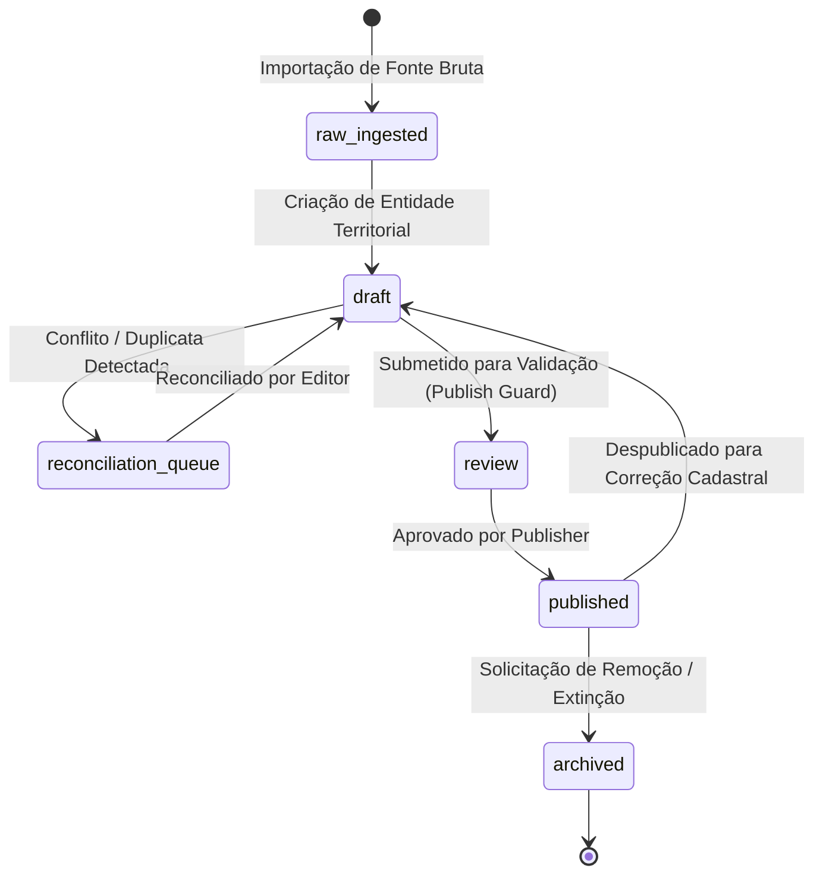

# ADR 0014 — Governança de Fontes Territoriais, Retenção, Reconciliação e Ciclo de Publicação (SEMTUR, ECOnexão e Google)

- **Status:** aceito pelo Owner (Gate H25.1 aprovado)
- **Data:** 27/08/2026
- **Autores:** Equipe de Arquitetura ECOnexão / Antigravity
- **Decisor:** Bruno Darwich, Proprietário do Produto (Owner)
- **Task Relacionada:** ECO-2502
- **Dependências:** ECO-2501 (Auditoria dos Datasets — `VERIFIED`)
- **Gate de Conclusão:** Gate Humano H25.1 — Aprovado com decisão de selo simples e curto.

---

## 1. Contexto e Problema

O ecossistema ECOnexão agrega informações geoespaciais e cadastrais de atores turísticos, culturais e de infraestrutura no polo Santarém / Alter do Chão / Pindobal a partir de três fontes com naturezas jurídicas, ciclos de vida e níveis de confiabilidade distintos:

1. **SEMTUR (Secretaria Municipal de Turismo de Santarém):** Inventário institucional oficial do município (674 registros auditados na ECO-2501). Possui autoridade pública originária sobre patrimônio, tipologia oficial, atrativos naturais e contatos institucionais, porém apresenta dados estáticos e não estruturados (ex: coordenadas ausentes em 145 registros, campos de funcionamento/redes sociais preenchidos em texto livre).
2. **Curadoria Editorial ECOnexão:** Dados inseridos, saneados e verificados em campo pela equipe editorial e comunitária da ECOnexão, regidos pelos papéis RBAC e Publish Guard do ADR 0006.
3. **Google Places API / Google Maps Platform:** Provedor comercial externo de busca de locais e coordenadas de satélite (737 registros legados auditados na ECO-2501). Fornece alta precisão geoespacial e dados dinâmicos de descoberta, mas possui restrições severas de licenciamento, expiração de referências (`place_id` / fotos) e nenhuma garantia de respaldo comunitário ou institucional.

A ausência de uma política explícita de autoridade e retenção gera riscos críticos:
- **Risco Jurídico/Institucional:** Atribuir à SEMTUR dados comerciais do Google ou apresentar como "certificado/garantido pela prefeitura" estabelecimentos que apenas constam em inventário aberto.
- **Risco de Integridade de Dados:** Sobrescrita silenciosa de dados oficiais por scrapers comerciais ou perda de rastreabilidade de correções manuais.
- **Risco de Licenciamento Google:** Armazenamento indevido de dados comerciais ou violação de termos de caching e atribuição.
- **Risco de Acessibilidade e Transparência:** Indução do turista a erro sobre horários ou rotas sem indicação clara da data e origem da informação.

---

## 2. Decisão Proposta

Fica proposta a seguinte governança para fontes, proveniência, deduplicação, retenção e publicação:

### 2.1 Matriz de Autoridade e Precedência por Campo

A composição da entidade consolidada pública de um Ator (`actors`) obedece a uma hierarquia estrita de autoridade campo a campo. Nenhuma fonte tem soberania absoluta sobre todos os atributos.

| Campo do Ator | 1ª Prioridade (Soberana) | 2ª Prioridade (Fallback Primário) | 3ª Prioridade (Descoberta/Complemento) | Regra de Reconciliação / Conflito |
|---|---|---|---|---|
| **Identificador Canônico (`id`)** | **ECOnexão (UUID v4)** | — | — | UUID imutável gerado na ingestão; nunca derivado de chaves externas instáveis. |
| **Nome Institucional / Fantasia** | **Curadoria Editorial** | **SEMTUR** | **Google Places** | Prevalece correção editorial; se ausente, adota SEMTUR; Google apenas se não constar na SEMTUR. |
| **Localização Espacial (`Point WGS84`)** | **Curadoria Editorial (Validado)** | **Google Places (Coordenada Satélite)** | **SEMTUR (Texto/Geocodificado)** | Coordenada validada por auditoria tem precedência; Google é preferível à SEMTUR quando a SEMTUR for imprecisa/ausente; nunca aplicar merge cego com distância > 100 m. |
| **Categoria e Taxonomia Canônica** | **Curadoria Editorial (ADR 0010/ECO-2503)** | **SEMTUR (Classificação Oficial)** | **Google Places (Tipo normalizado)** | Classificação auditada da ECOnexão tem precedência; SEMTUR define tipologia pública; Google é apenas heurística inicial. |
| **Telefone / E-mail / Contato Oficial** | **Curadoria Editorial** | **SEMTUR** | **Google Places** | Contato oficial da SEMTUR é preservado; enriquecimento editorial pode atualizar telefones operacionais. |
| **Horário de Funcionamento** | **Curadoria Editorial** | **Google Places** | **SEMTUR** | Horários SEMTUR costumam ser estáticos/desatualizados; Google e checagem editorial fornecem melhor fidelidade temporal. |
| **Instagram / Website** | **Curadoria Editorial** | **SEMTUR** | **Google Places** | Redes auditadas têm prioridade. |
| **Endereço Textual / Logradouro** | **Curadoria Editorial** | **SEMTUR** | **Google Places** | Endereço oficial SEMTUR é base; editorial corrige divergências locais (ex: vilas e praias). |
| **Selos / Certificações Territoriais** | **Curadoria Editorial / SEMTUR** | — | — | **Vedado a fontes comerciais terceiras (Google nunca gera selo).** |

---

### 2.2 Preservação do Raw Imutável e Rastreabilidade (`raw_source_records`)

1. **Princípio do Raw Imutável:** Todo payload original recebido de fontes externas (CSV SEMTUR, JSON Google Places, cadastros comunitários) deve ser gravado de forma imutável na tabela `raw_source_records` no momento da ingestão.
2. **Metadados Obrigatórios do Raw:**
   - `id UUID`: Identificador único do registro bruto.
   - `source_id VARCHAR`: Identificador da fonte (`semtur_inventory`, `google_places_api`, `editorial_curation`).
   - `external_id VARCHAR`: Identificador de origem na fonte (ex: número da página/linha SEMTUR, `place_id` Google).
   - `payload_json JSONB`: Cópia exata dos dados brutos recebidos (sem qualquer sanitização ou perda).
   - `payload_hash_sha256 VARCHAR(64)`: Hash criptográfico SHA-256 para auditoria de integridade e detecção de drift.
   - `ingestion_run_id UUID`: Vínculo com a execução de ingestão registrada em `ingestion_runs`.
   - `ingested_at TIMESTAMPTZ`: Timestamp da extração.
3. **Imutabilidade e RLS:** A tabela `raw_source_records` é somente leitura (`SELECT`) para processos autorizados e `INSERT` exclusivo do worker/job de ingestão via backend FastAPI. `UPDATE` e `DELETE` são terminantemente revogados via RLS e triggers de banco.

---

### 2.3 Referências Externas e Proveniência por Campo (`actor_external_refs` e `field_provenance`)

1. **Vínculos Externos (`actor_external_refs`):**
   - Um ator consolidado pode manter relacionamentos N:1 com múltiplas fontes externas.
   - Campos: `actor_id`, `source_id`, `external_id`, `source_url`, `last_seen_at`, `status_ref` (`active`, `stale`, `unlinked`).
   - Permite rastrear que o Ator X foi originado da Linha Y da SEMTUR e vinculado ao `place_id` Z do Google.
2. **Proveniência a Nível de Atributo (`field_provenance`):**
   - Para campos críticos (`location`, `category_id`, `opening_hours`, `phone`), registra-se:
     - `actor_id UUID`, `field_name VARCHAR`, `source_id VARCHAR`, `source_record_id UUID`, `confidence_score NUMERIC(3,2)`, `updated_at TIMESTAMPTZ`, `updated_by_actor_id UUID`.
   - Garante que a interface ou auditoria possa inspecionar exatamente de onde veio a coordenada ou o telefone exibido.

---

### 2.4 Reconciliação, Conflito e Deduplicação

1. **Vedação de Auto-Merge Fuzzy:**
   - Nenhuma correspondência heurística ou probabilística entre SEMTUR e Google é unificada automaticamente no banco de dados de produção.
   - Como evidenciado na ECO-2501, até mesmo pares com nome e telefone idênticos podem apresentar distâncias geográficas conflitantes (ex: Hadouken Sushi com conflito de 14,1 km).
2. **Fila Editorial de Reconciliação (`reconciliation_candidates`):**
   - O pipeline de ingestão gera registros de candidatos a duplicata quando:
     - Nome normalizado for similar (Levenshtein / Trigram > 0.8) E distância PostGIS < 500 m; OU
     - Telefone normalizado coincidir; OU
     - `place_id` for explicitamente indicado.
   - Status do candidato: `pending_review`, `merged`, `rejected_distinct_entities`, `ignored`.
3. **Decisão Humana e Reversibilidade:**
   - Apenas operadores com papel `editor` ou `publisher` (ADR 0006) podem aprovar o merge.
   - A fusão não apaga o registro secundário; atualiza `actor_external_refs` e o histórico de auditoria em `app_private.audit_logs`. Toda reconciliação é 100% reversível (*unmerge*).

---

### 2.5 Direitos Autorais, Retenção e Política de Uso dos Dados SEMTUR

1. **Natureza Jurídica dos Dados SEMTUR:**
   - O Inventário Turístico da SEMTUR é um documento público municipal informativo de interesse social e difusão turística.
   - A ECOnexão utiliza esses dados para promoção da sustentabilidade e fomento territorial comunitário, sem comercialização direta do catálogo bruto.
2. **Termos de Retenção e Atualização:**
   - Os dados do inventário SEMTUR permanecem arquivados como base cadastral histórica.
   - Havendo nova publicação oficial de inventário pelo Município de Santarém, o novo arquivo será ingerido como uma nova versão independente, gerando candidatos de reconciliação com a versão anterior.
3. **Direito de Retificação e Remoção pelo Proprietário/Comunidade:**
   - Qualquer proprietário de estabelecimento ou liderança comunitária pode solicitar retificação cadastral ou remoção do catálogo público via canal oficial de atendimento da ECOnexão (`suporte@econexao.app`).
   - A solicitação gera ticket de atendimento, transicionando o ator para `draft` ou `archived` após validação editorial.

---

### 2.6 Critérios e Diretrizes do Selo `Inventário SEMTUR`

O aplicativo ECOnexão exibirá uma sinalização discreta quando o ator for originário do inventário oficial da prefeitura.

1. **Critérios Estritos de Elegibilidade:**
   - O ator deve possuir vínculo ativo e comprovado em `actor_external_refs` com a fonte `semtur_inventory`.
   - O registro deve estar no estado `published` (homologado pelo Publish Guard do ADR 0006).
   - O registro não pode possuir pendências graves de localização ou denúncias comunitárias abertas.
2. **Diretrizes de Comunicação e Não-Certificação (Isenção Legal):**
   - **Label Curto e Simples Homologado pelo Owner:** **`SEMTUR`** (badge simples/enxuto nos cards) com suporte ao texto explicativo expandido no modal de detalhes.
   - **Proibições Textuais e Visuais:** É terminantemente **proibido** utilizar termos que comuniquem endosso, aprovação de qualidade, fiscalização em dia, certificação sanitária/ambiental ou garantia de funcionamento. Proibidos: *"Certificado pela SEMTUR"*, *"Recomendado pela Prefeitura"*, *"Verificado Oficialmente"*, *"Garantido pelo Município"*.
   - **Texto Explicativo de Apoio (Tooltip / Modal de Detalhes):**
     > *"Este estabelecimento consta no Inventário Turístico divulgado pela Secretaria Municipal de Turismo de Santarém (SEMTUR). As informações refletem o registro público catalogado e estão sujeitas a alterações pelos responsáveis."*
3. **Acessibilidade e Design Simples:**
   - O selo deve ter aspecto minimalista, sóbrio e neutro (badge compacto com o texto `SEMTUR`, em tom cinza-azulado institucional com contraste WCAG 2.1 AA).
   - Deve possuir semântica completa para leitores de tela: `accessibilityLabel="Origem dos dados: Inventário SEMTUR"` e `accessibilityHint="Toque para entender a origem das informações deste local"`.

---

### 2.7 Máquina de Estados Editoriais e Fluxo de Remoção/Correção

Alinhada ao ADR 0006, a governança de publicação territorial opera sob os seguintes estados:

1. **`raw_ingested`:** Registro bruto armazenado imutável em `raw_source_records`.
2. **`draft`:** Entidade Ator em preparação cadastral. Não visível ao turista.
3. **`reconciliation_queue`:** Estado de retenção editorial quando há ambiguidade ou candidato duplicado pendente.
4. **`review`:** Entidade saneada aguardando conferência de completude e verificação espacial.
5. **`published`:** Entidade ativa e visível no mapa público, feed e rotas.
6. **`archived`:** Entidade desativada (soft delete). Oculta de consultas públicas, mantida para integridade de histórico em viagens passadas (`trips`) e trilha de auditoria.

---

## 3. Consequências e Impactos Técnicos

### 3.1 Impactos Positivos
- **Conformidade Institucional e Jurídica:** Clara demarcação de responsabilidade e ausência de falsas garantias públicas.
- **Rastreabilidade Total:** Qualquer dado exibido no app pode ter sua origem e alterações rastreadas até o timestamp e operador exatos.
- **Resiliência do Pipeline:** O processo de ingestão e reconciliação se torna determinístico e auditável, evitando perda acidental de dados locais.

### 3.2 Impactos nos Próximos Marcos / Tasks
- **ECO-2503:** Utilizará as regras de taxonomia canônica estabelecidas e a autoridade por categoria.
- **ECO-2504:** Implementará a migration do schema com as tabelas `raw_source_records`, `actor_external_refs`, `field_provenance` e `reconciliation_candidates`.
- **ECO-2505:** Executará a ingestão dos 674 registros SEMTUR populando `raw_source_records` e `actor_external_refs`.
- **ECO-2509:** Criará a fila e interface de reconciliação editorial para os candidatos detectados na auditoria ECO-2501.
- **ECO-2512:** Renderizará o badge acessível `Inventário SEMTUR` nos cards e detalhes de atores conforme a especificação deste ADR.

---

## 4. Estado de Aprovação e Gate Humano H25.1

- [x] **Aprovação pelo Owner do Produto (Bruno Darwich — 27/08/2026):** Homologada a matriz de autoridade por campo, retenção raw imutável, reconciliação auditável e selo simples e curto com label `SEMTUR`.
- [x] **Validação Jurídica / Institucional (Princípio de Não-Certificação e Isenção de Garantias):** Incorporadas regras estritas de isenção de responsabilidade e proibição de alegações de endosso/garantia.

> **Status Atual:** **ACEITO / VERIFICADO**. Gate Humano H25.1 concluído com sucesso. Desbloqueia formalmente as tarefas **ECO-2504** (Schema e Proveniência) e **ECO-2507** (ADR Google Maps/Places).
