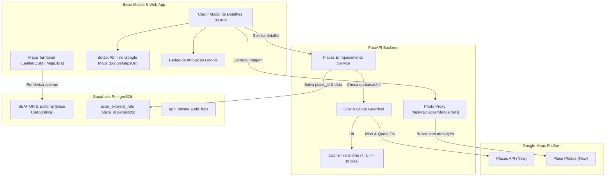

# ADR 0016 — Arquitetura de Integração Google Maps Platform: Termos de Serviço, Separação de Camadas, Places API (New), Mídia por Proxy, Atribuição e Gestão de Custos

- **Status:** aceito pelo Owner (Gate H25.3 aprovado)
- **Data:** 27/08/2026
- **Autores:** Equipe de Arquitetura ECOnexão / Antigravity
- **Decisor:** Bruno Darwich, Proprietário do Produto (Owner)
- **Task Relacionada:** ECO-2507 (ADR Google Maps, Places e Mídia)
- **Dependências:** ECO-2501 (Auditoria dos Datasets — `VERIFIED`), ECO-2502 / ADR 0014 (Governança de Fontes e Retenção — `aceito`), ADR 0003 (Adaptadores de Mapa — `aceito`), ADR 0008 (Política de Mídia e Privacidade — `aceito`), ADR 0015 (Taxonomia Hierárquica — `proposto`)
- **Gate de Conclusão:** Gate Humano H25.3 — Aprovado (Plataforma de mapa, termos de licenciamento, política de cache, field masks, proxy de mídia, quotas e teto orçamentário aceitos).

---

## 1. Contexto e Problema

No desenvolvimento do ecossistema ECOnexão (Marcos 2 e 4), a integração com o **Google Maps Platform** visa enriquecer o catálogo territorial do polo turístico Santarém / Alter do Chão / Pindobal com dados de alta fidelidade operacional (horários de funcionamento atualizados, telefones, fotografias recentes e deep links para navegação).

Entretanto, o uso de serviços comerciais da Google Maps Platform — especificamente **Places API (New)**, **Place Photos (New)**, **Maps SDKs (Android / iOS / JavaScript)** e **Google Business Profile (GBP) API** — impõe severas restrições jurídicas, técnicas e financeiras reguladas pelos *Google Maps Platform Terms of Service* (Universal & Service Specific Terms):

1. **Vedação de Mistura Cartográfica (*Non-Google Maps Restrictions* — Cláusula 3.2.3(a)):**
   - Os termos da Google proíbem expressamente a sobreposição ou exibição de Conteúdo Google (como coordenadas obtidas exclusivamente por Places/Geocoding, listagens de locais ou fotografias) diretamente sobre mapas base de terceiros (ex: OpenStreetMap, Leaflet ou MapLibre).
   - O uso de bibliotecas abertas como Leaflet/OSM com pins derivados do Google Places constitui infração direta de propriedade intelectual e licenciamento.
2. **Restrições de Caching e Retenção de Dados:**
   - É expressamente proibido armazenar permanentemente (*pre-fetching* ou *caching* indefinido) conteúdos de Places para criar bancos de dados concorrentes ou evitar requisições à API.
   - **Exceção de `place_id`:** O identificador `place_id` é o único atributo com armazenamento permanente autorizado, sob a condição mandatória de validação periódica de expiração (rotina de *refresh* a cada 30 dias).
   - Outros atributos (nomes, horários, telefones) só podem ser mantidos em cache transitório de performance por no máximo **30 dias**.
3. **Direitos Autorais e Vedação de Armazenamento de Fotos:**
   - Fotografias de locais do Google são protegidas por direitos autorais de seus respectivos autores. É terminantemente proibido baixar, persistir ou hospedar os binários dessas imagens em serviços próprios de armazenamento (como buckets do Supabase Storage).
   - A exibição exige repasse obrigatório de créditos de autoria (*author attributions*) e link direto para o Google Maps via `googleMapsUri`.
4. **Governança de Custos e Risco de Cobrança Indesejada (*Billing Surge*):**
   - Desde março de 2025, o Google Maps Platform adota modelo de preços baseado em SKUs categorizados (**Essentials**, **Pro**, **Enterprise**) e *Free Usage Caps* por SKU em vez do crédito mensal unificado de \$200.
   - O uso indevido de *wildcards* (`*`) em requisições de Places API (New) aciona automaticamente a tarifação de maior valor (**Enterprise / Atmosphere** — \$25.00 a \$40.00 por 1.000 chamadas).
5. **Natureza da Google Business Profile (GBP) API:**
   - A GBP API não é uma API aberta de busca pública territorial; trata-se de interface corporativa fechada (*gated API*) restrita à administração de perfis verificados pelo próprio proprietário comercial através de autenticação delegada OAuth 2.0.

Faz-se imperativo formalizar um ADR que resolva a arquitetura de mapa, estabeleça a segregação de camadas, defina os *field masks* mínimos, estruture o proxy de fotos com atribuição e implante guardrails rígidos de orçamento e contenção (*rollback*).

---

## 2. Análise Comparativa de Plataformas e Arquitetura de Mapas

| Dimensão de Avaliação | **Opção 1: Google Maps Universal (SDK Android/iOS + JS Web)** | **Opção 2: Leaflet / OpenStreetMap Puro (Sem Google)** | **Opção 3: Arquitetura Híbrida com Separação Estrita de Camadas (Recomendada)** |
| :--- | :--- | :--- | :--- |
| **Conformidade com Termos Google** | **Total**: Conteúdo Google exibido 100% sobre base Google. | **Total**: Nenhum conteúdo Google consumido. | **Total**: Segregação de responsabilidades entre mapa público aberto e detalhe enriquecido Google. |
| **Custo de Renderização Cartográfica** | **Elevado**: \$7,00 / 1.000 map loads (após free tier de 10.000 loads) no mobile e web. | **Zero**: Tiles abertos OSM / CARTO sem cobrança de licença por visualização. | **Otimizado / Baixo**: Base cartográfica gratuita para 100% dos acessos de feed e navegação geral; chamadas Google restritas ao detalhe sob demanda. |
| **Independência Territorial (SEMTUR / Comunitário)** | **Média**: Risco de subordinação visual à cartografia comercial. | **Máxima**: Foco 100% no inventário institucional da SEMTUR e rotas locais. | **Máxima**: Inventário oficial SEMTUR lidera a cartografia; Google atua apenas como complemento sob demanda. |
| **Experiência do Usuário (UX/Mobile)** | Nativa e fluida no mobile, mas com consumo de quota em cada abertura de tela. | Leve na web e mobile, excelente para rotas offline e trilhas ecológicas. | O melhor dos dois mundos: navegação rápida e leve na rota + visualização detalhada de horários/fotos no card. |
| **Risco de Bloqueio Legal / Descontinuidade** | Dependência de termos de faturamento do Google Cloud. | Nenhum risco de licença comercial. | Blindagem completa contra alterações de precificação da Google. |

---

## 3. Decisão Proposta

Fica proposta a seguinte arquitetura de governança, integração e conformidade para a Google Maps Platform:

---

### 3.1 Separação Estrita de Camadas Cartográficas (*Map Layer Isolation*)

Para cumprir rigorosamente a Cláusula 3.2.3(a) dos Termos do Google:

1. **Camada de Navegação e Mapa Público Territorial (`MapAdapter`):**
   - O mapa de rotas e catálogo exibido nas telas principais (`HomeScreen`, `RouteDetailScreen`, `CatalogScreen`) continuará operando sobre a infraestrutura aberta (`Leaflet` na Web e `MapLibre/Native` no Expo Android/iOS), consumindo exclusivamente dados do inventário **SEMTUR** e da **Curadoria Editorial ECOnexão**.
   - **Proibição Absoluta de Mistura:** É terminantemente **vedado** renderizar marcadores (*pins*), polilinhas ou fotos derivados exclusivamente do Google Places diretamente sobre a superfície do mapa Leaflet/OSM.
2. **Camada de Enriquecimento de Detalhes e Ações Externas:**
   - O enriquecimento com dados Google (horários de funcionamento atualizados, telefone comercial, fotos do local) ocorre exclusivamente no **Modal/Gaveta de Detalhes do Ator** (`ActorDetailSheet`) ou no Card expandido.
   - Sempre que dados originados da Places API forem exibidos, o componente renderizará:
     - O logotipo oficial do Google conforme as diretrizes de marca (*Google Attribution Guidelines*);
     - Créditos nominais dos autores das fotos (`authorAttributions`);
     - O botão de ação com deep link oficial `Abrir no Google Maps`, disparando o `googleMapsUri` nativo.

---

### 3.2 Field Masks Cirúrgicos e Mapeamento de SKUs (Places API New)

Para prevenir faturamento indevido, todas as requisições à **Places API (New)** devem obrigatoriamente incluir o header `X-Goog-FieldMask` contendo apenas os campos estritamente necessários. O uso de `*` é terminantemente bloqueado no código do conector.

| Operação / Fluxo | Header `X-Goog-FieldMask` Obrigatório | SKU Google Aplicado | Categoria de Preço | Finalidade no ECOnexão |
| :--- | :--- | :--- | :--- | :--- |
| **1. Matching e Descoberta (ECO-2509)** | `places.id,places.displayName,places.location,places.formattedAddress,places.types` | **Text Search / Nearby Search (Essentials)** | Essentials (Baixo Custo / Gratuito até cota base) | Busca e alinhamento de candidatos com registros SEMTUR. |
| **2. Refresh de Validação de ID (Job Mensal)** | `places.id` | **Place Details (Essentials - ID only)** | Essentials (Gratuito até 10.000/mês) | Verificação de vigência do `place_id` a cada 30 dias. |
| **3. Enriquecimento de Contato e Horário (Sob Demanda)** | `places.id,places.regularOpeningHours,places.currentOpeningHours,places.nationalPhoneNumber,places.websiteUri,places.googleMapsUri,places.googleMapsLinks.placeUri` | **Place Details (Pro)** | Pro | Exibição de horários e contatos operacionais no card de detalhes. |
| **4. Metadados de Fotos do Local (Sob Demanda)** | `places.id,places.photos` | **Place Details (Enterprise)** | Enterprise | Obtenção do `photo_reference` (`name`) e `authorAttributions`. |
| **5. Download do Binário de Foto (Via Proxy)** | Chamada direta ao endpoint `/v1/{name=places/*/photos/*}/media` | **Place Details Photos** (SKU `DCD1-FE97-8C71`) | Enterprise | Recuperação da imagem para exibição temporária na galeria. |

---

### 3.3 Política de Caching, Expiração e Refresh do `place_id`

1. **Persistência de `place_id`:**
   - O `place_id` retornado pela Google é persistido na tabela `app_private.actor_external_refs` com `source_id = 'google_places'` e `status_ref = 'active'`.
2. **Rotina de Refresh a cada 30 Dias:**
   - Em cumprimento aos termos de licenciamento, um job assíncrono do backend FastAPI executará a cada 30 dias o refresh dos `place_id`s armazenados:
     - Requisição com mask `places.id` para `https://places.googleapis.com/v1/places/{place_id}`.
     - Se o retorno for `200 OK` com o mesmo ID: atualiza `last_seen_at = now()`.
     - Se o retorno contiver um novo ID (redirecionamento de fusão cadastral do Google): atualiza `external_id` para o novo ID e registra no log de auditoria.
     - Se o retorno for `404 NOT_FOUND` (estabelecimento extinto no Google): transiciona `status_ref = 'stale'` e notifica a fila editorial.
3. **Cache Transitório de Atributos:**
   - Dados textuais (horários e telefones) recebidos da Places API são mantidos em cache volátil (Redis ou tabela efêmera em memória) com TTL máximo de **30 dias**, sendo sempre revalidados quando expirados.

---

### 3.4 Arquitetura do Proxy de Fotos e Atribuição de Autoria (Place Photos)

1. **Vedação de Download Permanente no Supabase Storage:**
   - Conforme fixado no ADR 0008, é **estritamente proibido** salvar binários de fotos do Google nos buckets `editorial-media` ou `avatars` do Supabase Storage.
2. **Endpoint Seguro de Proxy no FastAPI (correção normativa ECO-2510):**
   - O frontend nunca acessa as chaves de API do Google diretamente para carregar imagens. As imagens são solicitadas através da rota:
    `GET /api/v1/places/photos/{grant_opaco}?maxHeightPx=600&maxWidthPx=800`
   - O backend FastAPI atua como proxy reverso autenticado:
    - aceita somente um grant opaco, de uso único e vida curta, mantido em memória;
    - recupera a foto sob demanda na Google Place Photos API e a repassa sem expor a URL
      de redirecionamento da Google;
    - **não persiste nem cacheia** `photos[].name`, `photoUri`, `flagContentUri` ou bytes,
      inclusive em disco, Redis, banco e Supabase Storage; uma reinicialização remove grants;
    - responde `410` para grant expirado, `404` para removido/consumido e `503` seguro para
      falha upstream; a UI usa fallback sem foto;
    - define `Cache-Control: no-store`; formato e dimensões são os retornados pela Google,
      sem transcodificação local.
3. **Atribuição Mandatória de Fotógrafo (`authorAttributions`):**
   - Cada foto retornada possui os metadados de autoria em `authorAttributions` (nome do autor, URL do perfil no Google Maps, URI da foto).
   - O frontend renderizará sobreposto à imagem ou na legenda da galeria:
     - Ícone de câmera com o texto: *"Foto: {author.displayName}"*;
     - Link acessível para o perfil do autor;
    - Link acessível para `googleMapsUri` para ver a foto no contexto original do Google Maps.

> Correção normativa: a redação anterior que permitia cache de 30 dias e a persistência
> de referência de foto é revogada. A documentação oficial de Place Photos (New),
> revalidada em 27/08/2026, determina que o resource name não pode ser cacheado e pode
> expirar. Apenas `place_id` mantém a regra de retenção descrita em §3.3.

---

### 3.5 Governança da Google Business Profile (GBP) API

1. **Restrição Exclusiva a Proprietários Autorizados:**
   - A Google Business Profile (GBP) API **não** será utilizada como base de busca pública ou importador de dados em massa.
   - O conector GBP será ativado exclusivamente em módulos futuros de *Reivindicação de Estabelecimento*, onde um comerciante local autenticado no ECOnexão vincula seu perfil verificado via fluxo **OAuth 2.0** com escopo `https://www.googleapis.com/auth/business.manage`.
2. **Consentimento e Isolamento:**
   - Nenhum token de acesso de comerciante é compartilhado publicamente ou utilizado fora do escopo de atualização do seu próprio estabelecimento.

---

### 3.6 Guardrails de Segurança, Quotas, Orçamento e Rollback

1. **Restrições de Credenciais no Google Cloud Console:**
   - A chave de API do Google Maps Platform deve ser mantida exclusivamente no backend FastAPI (`GOOGLE_MAPS_API_KEY` injetada via Secret Manager / `.env` protegido).
   - A chave do backend deve possuir restrição de endereço IP do servidor de produção/staging.
   - **Nenhuma chave com permissão de Places API (New) será exposta nas variáveis públicas do Expo (`EXPO_PUBLIC_*`).**
2. **Teto Orçamentário e Alertas Automáticos:**
   - Orçamento mensal aprovado no Google Cloud Console com alertas automáticos via Cloud Monitoring / E-mail:
     - Alerta 1: 50% do orçamento mensal atingido;
     - Alerta 2: 80% do orçamento mensal atingido;
     - Alerta 3: 100% do orçamento mensal atingido (dispara corte de tráfego / interrupção de chamadas não essenciais).
   - Quotas diárias (*Daily Request Quota Caps*) configuradas no Google Cloud Console para limitar chamadas a no máximo 1.000 requisições/dia por SKU.
3. **Feature Flag e Mecanismo de Rollback:**
   - A sincronização e consulta com Google Places é governada pela Feature Flag de backend:
     `FEATURE_GOOGLE_PLACES_SYNC=false` (padrão em desenvolvimento e testes).
   - Em caso de estouro de quota, erro 429 (*Too Many Requests*), indisponibilidade da Google ou revogação de chaves:
     - O sistema desliga a flag instantaneamente;
     - A interface do aplicativo opera em modo *Graceful Fallback*, exibindo com 100% de estabilidade os dados canônicos da SEMTUR e da Curadoria Editorial, ocultando apenas os blocos opcionais de fotos do Google e horários dinâmicos.
4. **Isolamento de Testes e CI:**
   - Em cumprimento às regras de ouro do `AGENTS.md`, **nenhuma chamada de rede ao Google é permitida na suite de testes ou no CI**.
   - Todos os testes de backend e frontend utilizarão fixtures estáticas contratuais gravadas em `backend/tests/fixtures/google_places/`.

---

## 4. Consequências e Impactos Técnicos

### 4.1 Impactos Positivos
- **Segurança Jurídica Total:** Conformidade estrita com a Cláusula 3.2.3(a) dos Termos da Google e proteção contra processos de uso indevido de mapas.
- **Controle Orçamentário Previsível:** Eliminação do risco de cobranças astronômicas (*surprise bills*) mediante uso de field masks cirúrgicos e teto de quotas.
- **Preservação da Soberania dos Dados:** O ecossistema continua 100% funcional caso o serviço da Google seja descontinuado ou tarifado acima do orçamento comunitário.

### 4.2 Impactos nos Próximos Marcos / Tasks
- **ECO-2508:** Implementará o conector seguro `GooglePlacesClient` no FastAPI respeitando os headers `X-Goog-FieldMask`, timeouts, retries exponenciais e fixtures contratuais para testes.
- **ECO-2509:** Utilizará as regras de matching e a tabela `reconciliation_candidates` sem auto-merge destrutivo.
- **ECO-2510:** Criará o serviço de proxy reverso e cache transitório de fotos de locais com repasse de atribuições de autoria.
- **ECO-2512:** Renderizará os cards enriquecidos com selo de atribuição Google e botão `Abrir no Google Maps` (`googleMapsUri`).

---

## 5. Estado de Aprovação e Gate Humano H25.3
 
- [x] **Aprovação pelo Owner do Produto (Bruno Darwich — 27/08/2026):** Homologada a arquitetura híbrida de separação de camadas (Leaflet/MapLibre para SEMTUR e Google Maps URI/Card para enriquecimento), política de cache de 30 dias do `place_id`, proxy efêmero de fotos sem persistência no Storage, atribuição obrigatória de autoria e guardrails orçamentários.
- [x] **Validação dos Limites Orçamentários e Quotas:** Aprovada a governança por Field Masks cirúrgicos, Feature Flag `FEATURE_GOOGLE_PLACES_SYNC=false`, quotas diárias no GCP e alertas em 50%, 80% e 100% do teto mensal antes da ativação da chave em produção.
 
> **Status Atual:** **ACEITO / VERIFICADO**. Gate Humano H25.3 concluído com sucesso. Desbloqueia formalmente a tarefa **ECO-2508** (Conector Places API New e Guardrails).
