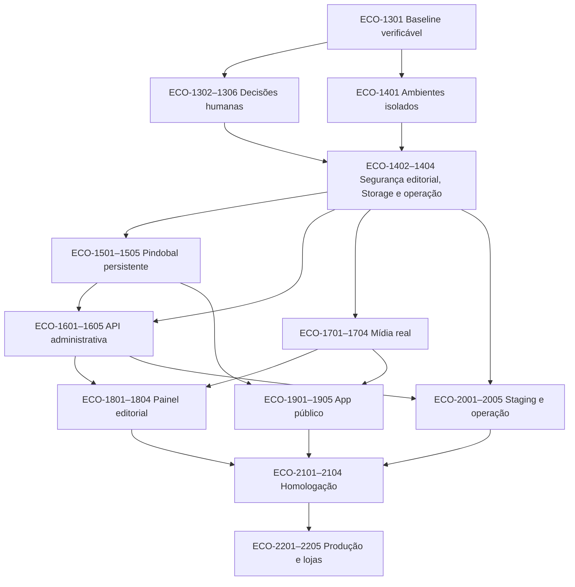

# Dependências, paralelismo e conflitos

## Grafo por resultado

## Matriz de execução

| Task | Executor sugerido | Pode rodar em paralelo com | Conflita com | Revisão cruzada |
|---|---|---|---|---|
| ECO-1301 | Codex | nenhuma até restaurar Git | todas que dependem do baseline | sim |
| ECO-1302 | humano/owner | ECO-1303–1306 | ECO-2001 se ainda aberta | owner + Codex |
| ECO-1303 | humano/owner | ECO-1302, 1304–1306 | ECO-1403, ECO-1601, ECO-1801 | obrigatória |
| ECO-1304 | humano/owner | ECO-1302, 1303, 1305, 1306 | ECO-1902 | obrigatória |
| ECO-1305 | humano/owner | ECO-1302–1304, 1306 | ECO-1402, ECO-1701–1703 | obrigatória |
| ECO-1306 | humano/owner | ECO-1302–1305 | ECO-1401, 1905, 2201–2203 | owner |
| ECO-1401 | Codex | ADRs humanos | `backend/.env*`, scripts Supabase | obrigatória |
| ECO-1402 | Codex | ECO-1404 | mesma migration/Storage de ECO-1704 | obrigatória |
| ECO-1403 | Codex | ECO-1402, 1404 | models, migrations, OpenAPI admin | obrigatória |
| ECO-1404 | indiferente | ECO-1402, 1403 | workflows/runbooks de ECO-2004 | obrigatória |
| ECO-1501 | Codex | ECO-1601 contrato | seed, repositories, ingestion models | obrigatória |
| ECO-1502 | Codex | ECO-1602 após contrato | importers/fixtures/contrato Pindobal | sim |
| ECO-1503 | Codex | UI admin shell | spatial importer/repos/migrations | sim |
| ECO-1504 | Codex | nenhuma no mesmo test DB | dados de test/staging | obrigatória |
| ECO-1505 | indiferente | ECO-1601 | reports/runbooks/jobs | sim |
| ECO-1601 | Codex | ECO-1501 | OpenAPI, schemas, generated types | obrigatória |
| ECO-1602 | Codex | ECO-1701 | admin region/route files | sim |
| ECO-1603 | Codex | ECO-1701 | admin actor/category files | sim |
| ECO-1604 | Codex | ECO-1702 | workflow/reconciliation/audit | obrigatória |
| ECO-1605 | Codex | ECO-1703 | jobs/export/idempotency | obrigatória |
| ECO-1701 | Codex | ECO-1602/1603 | Storage service, avatar app files | obrigatória |
| ECO-1702 | Codex | ECO-1602/1603 | media models/migrations | obrigatória |
| ECO-1703 | indiferente | ECO-1604 | territorial DTO/repos/app images | sim |
| ECO-1704 | Codex | nenhuma usando mesmos buckets | Storage migration/test DB | obrigatória |
| ECO-1801 | Google Antigravity | ECO-1902/1903 | app shell/package if same project | sim |
| ECO-1802 | Google Antigravity | ECO-1902 | admin route/origin screens | sim |
| ECO-1803 | Google Antigravity | ECO-1903 | admin actor/media screens | sim |
| ECO-1804 | Google Antigravity | ECO-1904 | admin workflow screens | obrigatória |
| ECO-1901 | Google Antigravity | ECO-1902–1904 | public route/catalog/hooks | sim |
| ECO-1902 | Google Antigravity | ECO-1901, 1903, 1904 | auth/session/navigation | obrigatória |
| ECO-1903 | Google Antigravity | ECO-1901, 1902, 1904 | AppContext/theme/query client | sim |
| ECO-1904 | Google Antigravity | ECO-1901–1903 | profile/trips/actor screens | sim |
| ECO-1905 | Google Antigravity | ECO-2001 | app.json/eas/deep links/legal UI | obrigatória |
| ECO-2001 | Codex | ECO-1901–1904 | Render/startup/backend config | obrigatória |
| ECO-2002 | Codex | ECO-2003 | workflows/migration scripts | obrigatória |
| ECO-2003 | Codex | ECO-2002, 2004 | hosting config/CORS/domains | sim |
| ECO-2004 | Codex | ECO-2003 | observability/runbooks/workflows | obrigatória |
| ECO-2005 | Google Antigravity | ECO-2004 | escritas concorrentes no banco de staging | obrigatória |
| ECO-2101 | Google Antigravity | ECO-2102, 2103 em runners separados | E2E fixtures/shared reports | sim |
| ECO-2102 | Google Antigravity | ECO-2101, 2103 | Android build/E2E config | sim |
| ECO-2103 | humano/owner + Antigravity | ECO-2101, 2102 | iOS signing/build config | sim |
| ECO-2104 | Codex + humano/owner | após evidências 2101–2103 | security/legal/perf reports | obrigatória |
| ECO-2201 | humano/owner | nenhuma | release checklist | owner |
| ECO-2202 | Codex | nenhuma no mesmo ambiente | production migrations/data | obrigatória |
| ECO-2203 | Codex | após ECO-2202 | production API/Web/DNS | obrigatória |
| ECO-2204 | humano/owner | após Gate 7 | EAS/store metadata e rollout | obrigatória |
| ECO-2205 | humano/owner | após publicação nas lojas | runbooks/monitoramento | owner |

## Arquivos de alta contenção

| Arquivo/área | Regra |
|---|---|
| `docs/openapi.yaml` e tipos gerados | um autor por vez; merge antes de UI |
| `supabase/migrations/` | uma migration ativa por domínio; nunca renumerar concorrente |
| `backend/app/models/domain.py` | reservado pelo autor da mudança de schema |
| `backend/app/core/security.py` | nenhuma edição paralela; revisão cruzada obrigatória |
| `econexao-app/app/_layout.tsx` | coordenar Auth, painel e deep links |
| `econexao-app/app.json` / `eas.json` | somente task de configuração/release |
| lockfiles e workflows | reservar explicitamente; não resolver mecanicamente |
| `.env*` | nunca versionar, compartilhar ou editar entre agentes |
